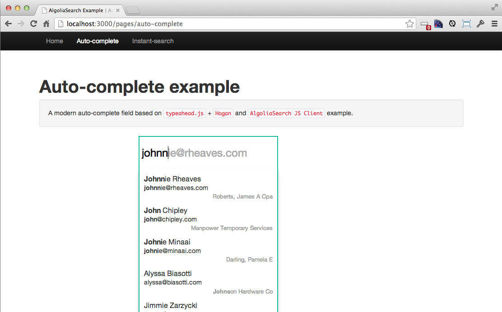
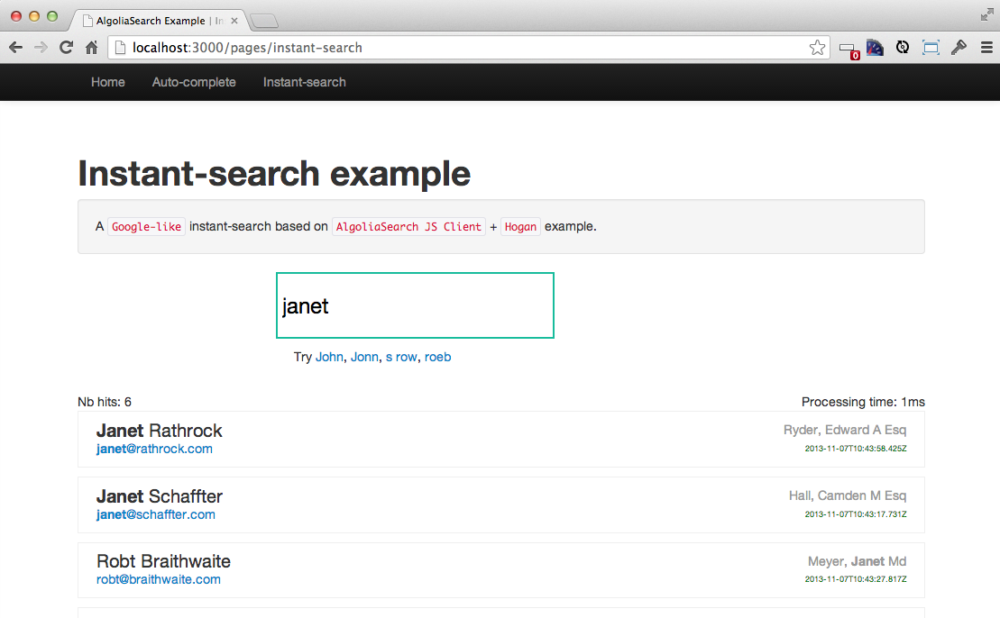

AlgoliaSearch Rails Example
============================

This is a Ruby on Rails application indexing 500 ```Contact``` objects and providing auto-completion and instant-search samples. See [algoliasearch-rails](http://github.com/algolia/algoliasearch-rails) gem.

A ```Contact``` is defined by:

* A name
* An email adress
* A company name

An [Algolia](http://www.algolia.com) account is required to test it.

Dependencies
------------

```ruby
gem 'algoliasearch-rails' # provides AlgoliaSearch rails integration
                          #  + AlgoliaSearch JS Client
                          #  +  patched typeahead.js
gem 'jquery-rails'
gem 'hogan_assets'
```

Installation
--------------

* ```git clone https://github.com/algolia/algoliasearch-rails-example.git```
*  ```bundle install```

Populate your DB and start indexing
--------------------------------------
*  Create your ```config/application.yml``` based on ```config/application.example.yml``` with your [Algolia](http://www.algolia.com) credentials
*  ```bundle exec rake db:migrate```
*  ```bundle exec rake db:seed```

Start the application
---------------------
*  ```bundle exec rails server```
*  Enjoy your ```http://localhost:3000``` examples!





